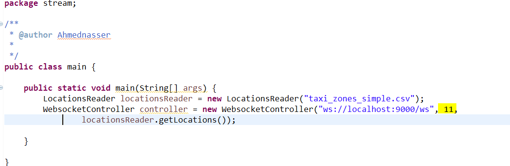
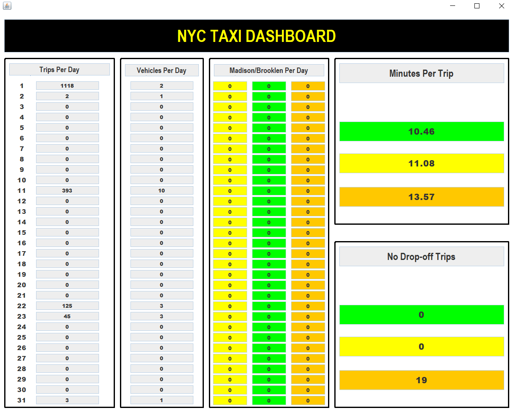
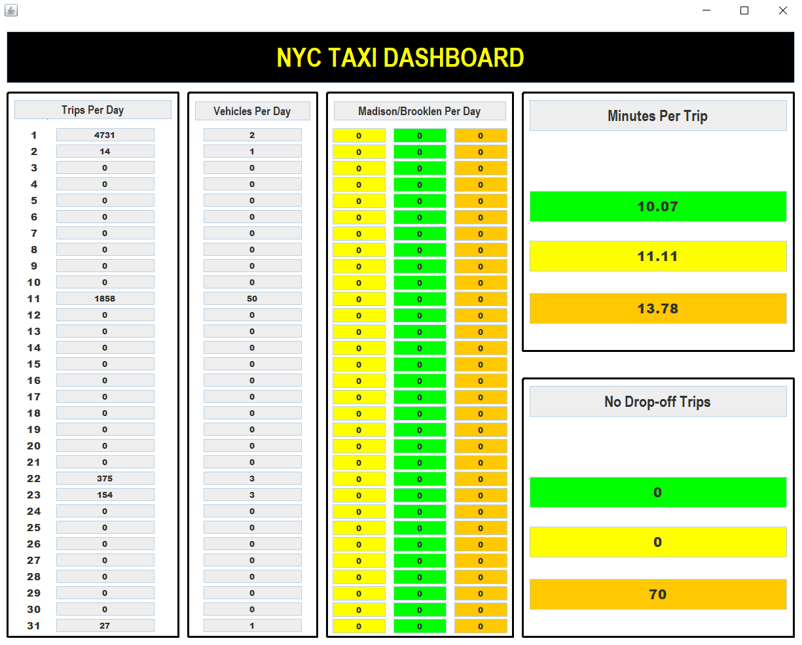
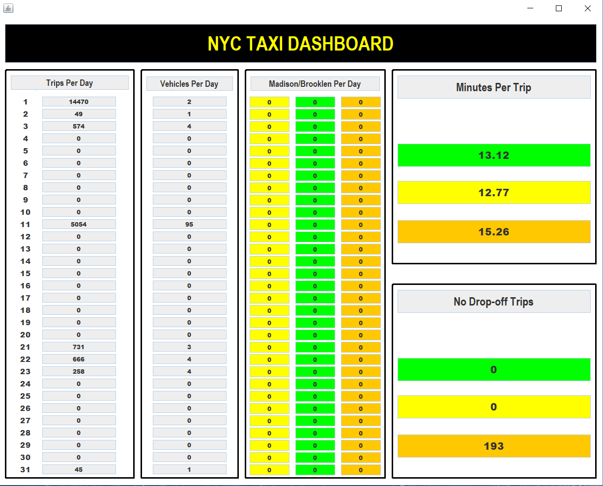
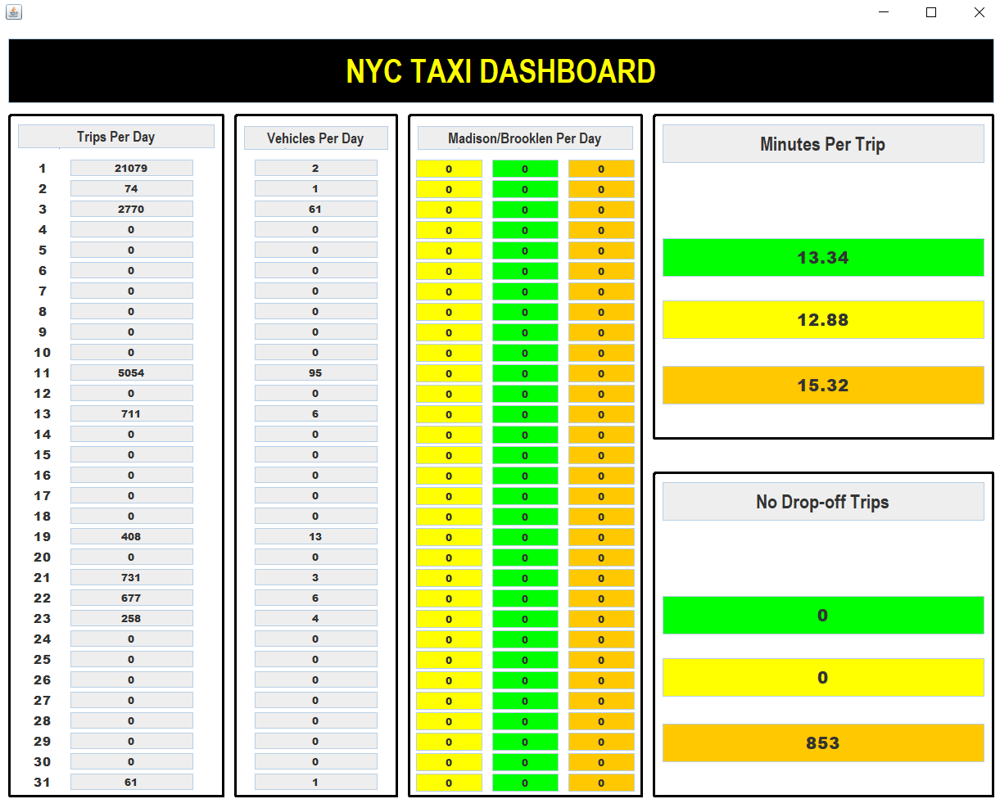
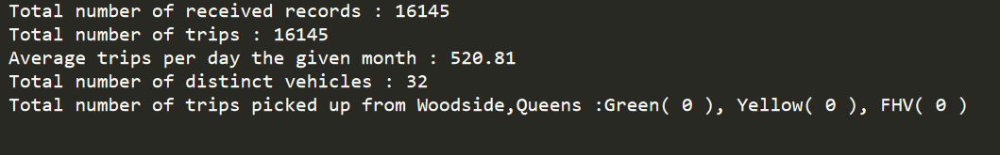

# PlayWithStreams
*SMARTERA CHALLENGE*

*Introduction*

A stream of NYC Taxi & Limousine Commission data for November 2017 is given using Websocket.
It is Required to implement Real-Time Dashboard.

*Dashboard*

- From stream\test\main.java file : You Can Choose any Month to start the Dashboard passing The Month Number as a parameter to WebsocketController

in addition to Path of LocalHost:9000

- The Dashboard will start to track the data of everyday of the month.
- Note : Orange bracket to indicate FHV Taxis.

*Screenshots*

*Results File*

- Result file contains info about total trips. these results in result.txt file are after 2 minutes from running.

- Executable file ia added.
